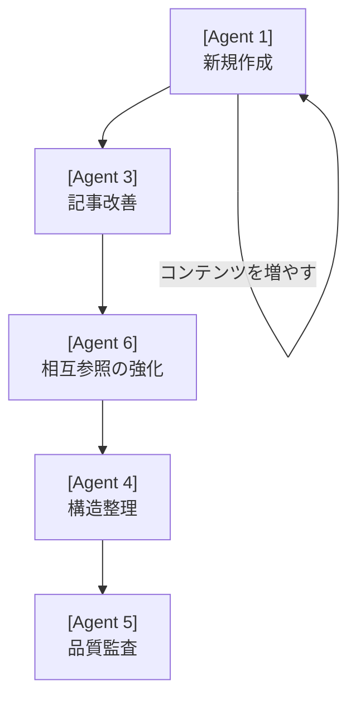
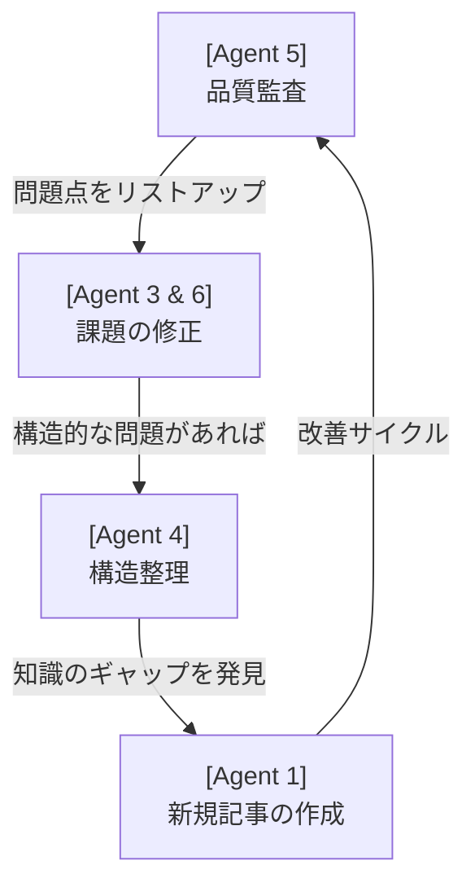
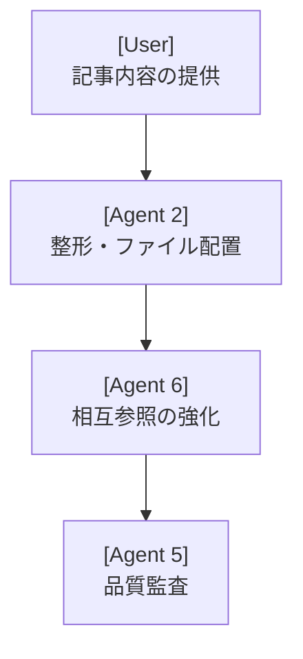

# **Obsidian Agents ナレッジベース**

このカテゴリは、Obsidianナレッジベース内で動作するAIエージェントの設計、運用、および管理に関するドキュメント（プロンプト）を集約します。これらのエージェントを組み合わせることで、知識の追加、整理、品質維持を体系的かつ効率的に行うことができます。

## **🎯 エージェント一覧**

各エージェントは特定の役割を担っています。

| 記事名 | 目的・役割 |
| :---- | :---- |
| [[1-new-article-creation]] | **新規記事の作成**: 新しい知識をゼロから創出し、ベースを拡張する。 |
| [[2-file-organization-and-markdown-formatting]] | **記事の整形と配置**: 既存のテキストを整形し、適切なカテゴリに配置・統合する。 |
| [[3-existing-article-improvement]] | **既存記事の改善**: 古い情報や不十分な内容を更新・強化する。 |
| [[4-category-structure-organization]] | **カテゴリ構造の整理**: 記事の構成や学習フローを最適化する。 |
| [[5-article-quality-audit]] | **記事の品質監査**: カテゴリ全体の品質を網羅的にチェックする。 |
| [[6-cross-reference-enhancement]] | **相互参照の強化**: 記事間のリンクを増やし、知識のネットワーク化を図る。 |

## **⚙️ エージェントの活用方法 (ワークフロー)**

エージェントは単体でも使用できますが、目的に応じてワークフローとして組み合わせることで、より大きな効果を発揮します。

### **ワークフロー1：新規カテゴリーの構築・拡張フロー 🚀**

新しい知識カテゴリーをゼロから構築したり、既存のカテゴリーに新しい記事を積極的に追加していく際の、**成長志向**のワークフローです。

フロー:  
新規作成 -> (繰り返し) -> 記事改善 -> 相互リンク強化 -> (必要に応じて)構造整理 -> (最終確認)品質監査  
**ステップごとの詳細**:

1. **[Agent 1] 新規記事の作成**:  
   * カテゴリーの骨子となる新しい記事を作成・追加します。このプロセスを繰り返し、コンテンツの量を増やしていきます。  
2. **[Agent 3] 既存記事の改善**:
   * 記事が増えるにつれて、初期に作成した記事の情報が古くなったり、説明が不十分に感じられることがあります。このエージェントで特定の記事をターゲットに改善し、品質を向上させます。  
3. **[Agent 6] 相互参照の強化**:
   * カテゴリー内の記事がある程度揃ってきたら、記事間の関連性を強化します。関連キーワードや前提知識へのリンクを体系的に追加し、知識ネットワークを密にします。  
4. **[Agent 4] カテゴリー構造の整理**:
   * 記事が大幅に増え、初期の想定よりも構造が複雑になった場合、このエージェントで全体的な構成を見直します。「初級→中級→上級」といった学習フローを最適化し、索引ファイルを再構築します。  
5. **[Agent 5] 品質監査**:
   * カテゴリー全体が完成に近づいた最終段階で、総合的な品質チェックを行います。リンク切れ、表記揺れ、構造の矛盾などを洗い出し、最終的な仕上げをします。

### **ワークフロー2：既存カテゴリーの品質維持・改善フロー 🛠️**

すでにコンテンツが充実している既存のカテゴリーの品質を維持し、さらに洗練させていくための、**メンテナンス主体**のワークフローです。

フロー:  
品質監査 -> (監査結果に基づき) -> 記事改善 / 相互リンク強化 -> (構造的問題があれば)構造整理 -> (新たな知識を追加)新規記事の作成  
**ステップごとの詳細**:

1. **[Agent 5] 品質監査**:
   * 最初にカテゴリー全体の健全性を診断します。リンク、構造、内容の品質を網羅的にチェックし、問題点をリストアップした「監査レポート」を作成します。これが全ての改善活動の起点となります。  
2. **[Agent 3 & 6] 課題の修正**:
   * 監査レポートに基づき、具体的な修正作業に入ります。  
     * **既存記事の改善 (Agent 3)**: 内容の古さや質の低さが指摘された個別の記事を修正します。
     * **相互参照の強化 (Agent 6)**: リンク不足や関連性の欠如が指摘された箇所に、適切な内部リンクを追加します。
3. **[Agent 4] カテゴリー構造の整理**:
   * 監査によって、学習フローの非効率性やグルーピングの不自然さといった構造的な問題が明らかになった場合、このエージェントでカテゴリー全体を再編成します。  
4. **[Agent 1] 新規記事の作成**:  
   * メンテナンスの過程で、新たに埋めるべき知識のギャップが見つかることがあります。そのギャップを埋めるための新しい記事を作成し、知識ベースをさらに充実させます。

### **ワークフロー3：外部コンテンツの取り込み・統合フロー 📥**

外部で作成済みのドキュメントやメモを、ナレッジベースの形式に整形して迅速に統合するためのワークフローです。

フロー:
ユーザーによる記事提供 -> 整形・配置 -> 相互リンク強化 -> 品質監査
**ステップごとの詳細**:

1. **[Agent 2] 記事の整形と配置**:
   * ユーザーから提供された記事内容を受け取り、Markdownの整形、タグ付け、ファイル配置を自動で行います。
2. **[Agent 6] 相互参照の強化**:
   * 新しく追加された記事と、既存の記事との間に関連リンクを付与し、知識ネットワークに統合します。
3. **[Agent 5] 品質監査**:
   * 最終的に、追加された記事が全体の品質基準を満たしているかを確認します。

### **個別タスクとしての利用 (単発利用) ⚡**

必ずしも体系的なワークフローに組み込む必要はなく、日々の運用の中で各エージェントを単独で利用することも非常に効果的です。

* **「新しいトピックについて記事を書いてほしい」**
  * → **Agent 1 (新規記事作成)** を単独で使用します。
* **「手元にあるマークダウンをナレッジベースに追加したい」**
  * → **Agent 2 (記事の整形と配置)** を使用して、フォーマットを整えつつ素早く追加します。
* **「特定の記事のコード例が古いことに気づいた」**  
  * → **Agent 3 (既存記事改善)** を使用して、その記事だけを素早く更新します。
* **「記事を読んでいて、関連する別記事へのリンクがないことに気づいた」**  
  * → **Agent 6 (相互参照強化)** を使用して、文脈に合ったリンクを追加します。
* **「あるカテゴリーの記事が増えてきたので、索引だけ整理したい」**  
  * → **Agent 4 (カテゴリー構造整理)** の機能の一部（索引ファイルの再構築）に集中して利用します。